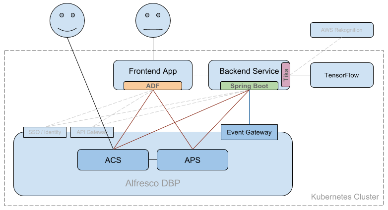

# Overview

In this exercise we'll develop a custom application on top of the Alfresco Digital Business Platform that uses image recognition to automatically tag images added to the Alfresco Content Services repository, then start a process that requests verification of tags by a human before actually associating them with the content in the repository.

# Architecture

## [Alfresco Content Services](https://www.alfresco.com/platform/content-services-ecm)

Various users will be adding content to the repository.

## Alfresco Event Gateway (Proof of Concept)

A component which enables event consumption from the Alfresco Digital Business Platform.

## [Backend Service](alfresco-devcon-2018-backend-service)

Monitors Alfresco events from the Event Gateway for addition of images, automatically tags them via image recognition, and starts an instance of the tag verification process.

It can also return a history of past tagging results via REST API.

### Technologies Involved

* [Apache Tika](https://tika.apache.org/)
* [TensorFlow](https://www.tensorflow.org/)
* [Apache Camel](http://camel.apache.org/)
* [Apache Kafka](https://kafka.apache.org/)
* [Spring Boot](https://projects.spring.io/spring-boot/)

## [Alfresco Process Services](https://www.alfresco.com/platform/process-services-bpm)

An Alfresco Process Services [process is defined](rgauss-devcon-2018-process) for designated users to verify the resulting tags.

## [UI Application](alfresco-devcon-2018)

End-users access the UI to verify tags.

### Technologies Involved

* [Alfresco Application Development Framework](https://community.alfresco.com/community/application-development-framework)
* [NGINX Web Server](https://www.nginx.com/)

# Setup

## 1. Alfresco DBP Deployment

See [alfresco-dbp-deployment](https://github.com/Alfresco/alfresco-dbp-deployment)

## 2. Alfresco Event Gateway PoC

See [alfresco-event-gateway-poc-deployment](alfresco-event-gateway-poc-depoyment)

## 3. Tika / TensorFlow Docker Image

See [Tika / TensorFlow](rgauss-devcon-2018-backend-service)

## 4. Create Tagging User

At the moment the example requires a user with the same username and password in both ACS and APS.

## 5. Import APS Process

See [rgauss-devcon-2018-process](rgauss-devcon-2018-process)

## 6. Backend Service

See [rgauss-devcon-2018-backend-service-deployment](rgauss-devcon-2018-backend-service-deployment)

## 7. UI

See [rgauss-devcon-2018-ui-deployment](rgauss-devcon-2018-ui-deployment)

TODO: Parent Helm chart

