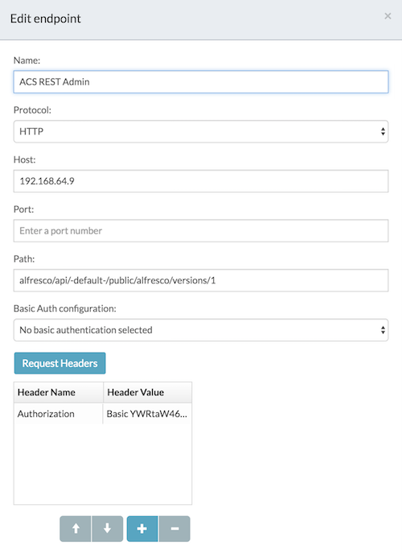
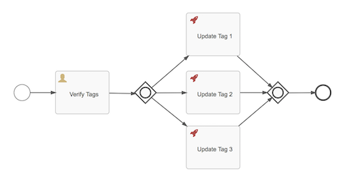

# APS App Setup

#### 1. Add your license to APS

#### 2. Create a User

#### 3. Create a Basic Auth entry, i.e. 'ACS REST Admin'

#### 4. Create an Endpoint, i.e.  'ACS REST Minikube'

There seems to be a bug with using Basic Auth in some versions of APS so you may need to chose no Basic Auth and manually add an `Authorization` header.



#### 5. Zip and Import the `Tag Verification` app definition

You should be able to renew the user identifiers during 



# Start a Process Instance

1. Get the id of the process definition created, i.e.:

```
GET http://192.168.64.9/activiti-app/api/enterprise/process-definitions
```
```json
{
    "size": 1,
    "total": 1,
    "start": 0,
    "data": [
        {
            "id": "TagVerification:5:163",
            "name": "Tag Verification",
            "description": null,
            "key": "TagVerification",
            "category": "http://www.activiti.org/processdef",
            "version": 5,
            "deploymentId": "160",
            "tenantId": "tenant_1",
            "metaDataValues": [],
            "hasStartForm": true
        }
    ]
}
```

where `192.168.64.9` is your Minikube IP or K8s cluster ELB.

2. Start a new process instance with the form field values:

```
POST http://192.168.64.9/activiti-app/api/enterprise/process-instances
```
```json
{
  "processDefinitionId": "TagVerification:5:163",
  "values": {
    "alfrescocontentnodeid": "205cae92-8af0-41d1-8f22-b17fe0833e01",
    "tag1": "tag value 12121"
  }
}
```

